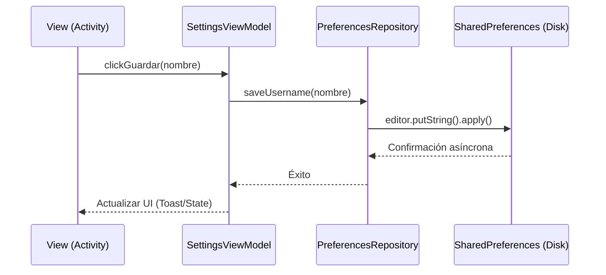

La API de **SharedPreferences** es el mecanismo más sencillo y eficiente en Android para persistir pequeñas cantidades de datos primitivos (booleans, strings, ints, etc.). Estos datos se guardan en un archivo XML privado dentro de la carpeta interna de la aplicación.

## Conceptos Fundamentales

A diferencia de una base de datos relacional, SharedPreferences utiliza una estructura de **clave-valor**. Es ideal para:
- Preferencias de usuario (Modo oscuro, idioma).
- Tokens de sesión temporales.
- Flags de estado (ej: si es la primera vez que se abre la app).

:::warning Cuándo NO usarlo
No utilices SharedPreferences para almacenar listas grandes de objetos, imágenes o datos sensibles sin cifrar. Para datos estructurados complejos, utilizaremos **Room**.
:::

## Tutorial Paso a Paso: Gestión de Preferencias

En este tutorial crearemos un sistema para guardar el nombre de usuario y la preferencia de notificaciones utilizando una arquitectura limpia.

### 1. Prerrequisitos

Asegúrate de tener habilitado el **DataBinding** en tu archivo `build.gradle`:

```gradle title="app/build.gradle"
android {
    ...
    buildFeatures {
        dataBinding true
    }
}
```

### 2. Diagrama de Arquitectura

Para seguir las buenas prácticas de desarrollo Android, no accederemos a las preferencias directamente desde la Actividad. Utilizaremos un **Repositorio** y un **ViewModel**.



### 3. Repositorio de Preferencias

El repositorio se encarga de la lógica de persistencia.

```java title="java/data/PreferencesRepository.java"
package com.example.pmdm.data;

import android.content.Context;
import android.content.SharedPreferences;

public class PreferencesRepository {
    private static final String PREF_NAME = "user_prefs";
    private static final String KEY_USERNAME = "username";
    private static final String KEY_NOTIFICATIONS = "notifications";
    
    private final SharedPreferences sharedPreferences;

    public PreferencesRepository(Context context) {
        // Usamos MODE_PRIVATE para que solo nuestra app pueda acceder
        this.sharedPreferences = context.getSharedPreferences(PREF_NAME, Context.MODE_PRIVATE);
    }

    public void saveUsername(String name) {
        sharedPreferences.edit().putString(KEY_USERNAME, name).apply();
    }

    public String getUsername() {
        return sharedPreferences.getString(KEY_USERNAME, "");
    }

    public void setNotificationsEnabled(boolean enabled) {
        sharedPreferences.edit().putBoolean(KEY_NOTIFICATIONS, enabled).apply();
    }

    public boolean areNotificationsEnabled() {
        return sharedPreferences.getBoolean(KEY_NOTIFICATIONS, true);
    }
}
```

### 4. ViewModel

El ViewModel expone los datos a la vista y gestiona los estados.

```java title="java/ui/SettingsViewModel.java"
package com.example.pmdm.ui;

import androidx.lifecycle.LiveData;
import androidx.lifecycle.MutableLiveData;
import androidx.lifecycle.ViewModel;
import com.example.pmdm.data.PreferencesRepository;

public class SettingsViewModel extends ViewModel {
    private final PreferencesRepository repository;
    
    // LiveData para vincular con la UI mediante DataBinding
    public MutableLiveData<String> username = new MutableLiveData<>("");
    public MutableLiveData<Boolean> notificationsEnabled = new MutableLiveData<>(true);

    public SettingsViewModel(PreferencesRepository repository) {
        this.repository = repository;
        // Cargamos los valores iniciales del repositorio
        username.setValue(repository.getUsername());
        notificationsEnabled.setValue(repository.areNotificationsEnabled());
    }

    public void saveSettings() {
        repository.saveUsername(username.getValue());
        repository.setNotificationsEnabled(notificationsEnabled.getValue());
    }
}
```

### 5. Layout con DataBinding

Definimos los recursos de texto primero para evitar el "hardcoding":

```xml title="res/values/strings.xml"
<resources>
    <string name="hint_username">Nombre de usuario</string>
    <string name="label_notifications">Habilitar notificaciones</string>
    <string name="btn_save">Guardar Preferencias</string>
</resources>
```

Y el layout vinculado al ViewModel:

```xml title="layout/activity_settings.xml"
<layout xmlns:android="http://schemas.android.com/apk/res/android">
    <data>
        <variable
            name="viewmodel"
            type="com.example.pmdm.ui.SettingsViewModel" />
    </data>

    <LinearLayout
        android:layout_width="match_parent"
        android:layout_height="match_parent"
        android:orientation="vertical"
        android:padding="16dp">

        <EditText
            android:layout_width="match_parent"
            android:layout_height="wrap_content"
            android:hint="@string/hint_username"
            android:text="@={viewmodel.username}" />

        <CheckBox
            android:layout_width="wrap_content"
            android:layout_height="wrap_content"
            android:text="@string/label_notifications"
            android:checked="@={viewmodel.notificationsEnabled}" />

        <Button
            android:layout_width="match_parent"
            android:layout_height="wrap_content"
            android:text="@string/btn_save"
            android:onClick="@{() -> viewmodel.saveSettings()}" />

    </LinearLayout>
</layout>
```

:::info Two-Way DataBinding
Fíjate en el uso de `@={...}`. Esto indica un **vínculo bidireccional**: si el usuario escribe en el `EditText`, el valor en el `MutableLiveData` del ViewModel se actualiza automáticamente.
:::

---

### 6. Consideraciones de Rendimiento
- **`apply()` vs `commit()`**: Usa siempre `apply()` ya que guarda los cambios de forma asíncrona en memoria y luego escribe en disco, evitando bloquear el hilo principal (UI Thread). `commit()` es síncrono y devuelve un boolean, úsalo solo si necesitas verificar inmediatamente si la escritura fue exitosa.

