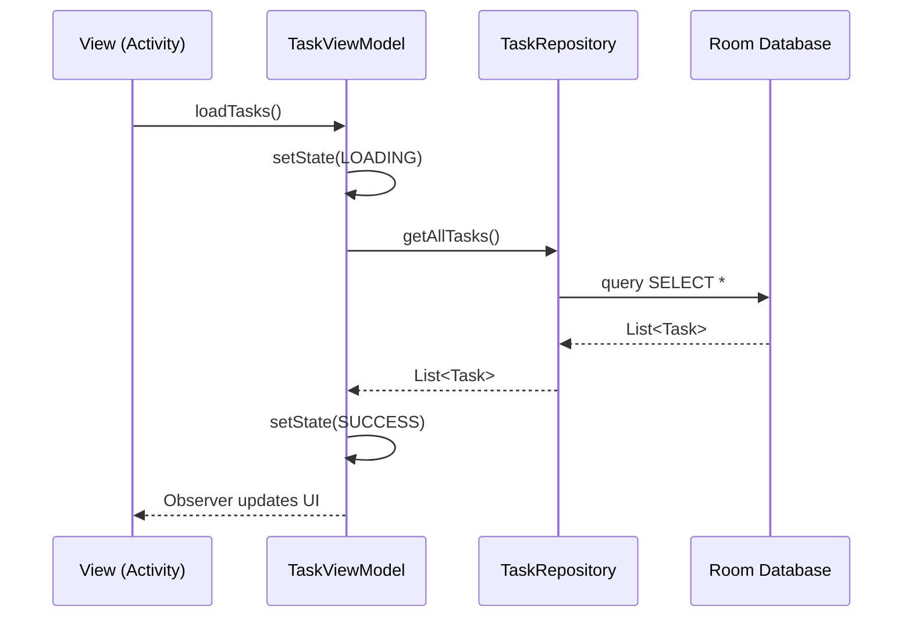

En este tutorial práctico implementaremos una aplicación de **Gestión de Tareas** que permite persistencia local completa. Aprenderás a integrar Room siguiendo la arquitectura recomendada por Google y gestionando los estados de la interfaz de forma profesional.

## 1. Prerrequisitos

Asegúrate de incluir las dependencias de Room y habilitar el **DataBinding** en tu proyecto Android Studio.

```gradle title="app/build.gradle"
android {
    ...
    buildFeatures {
        dataBinding true
    }
}

dependencies {
    def room_version = "2.6.1"

    implementation "androidx.room:room-runtime:$room_version"
    annotationProcessor "androidx.room:room-compiler:$room_version"
    
    // Opcional: para usar LiveData con Room
    implementation "androidx.room:room-ktx:$room_version"
}
```

## 2. Diagrama de Arquitectura

El flujo de información sigue una jerarquía estricta para garantizar la separación de conceptos y la facilidad de testeo.



## 3. Modelo y Acceso a Datos (Entidad y DAO)

Definimos nuestra tabla y las operaciones que realizaremos sobre ella.

```java title="java/model/Task.java"
@Entity(tableName = "tasks")
public class Task {
    @PrimaryKey(autoGenerate = true)
    private int id;

    @ColumnInfo(name = "title")
    private String title;

    @ColumnInfo(name = "completed")
    private boolean completed;

    // Constructor, Getters y Setters
    public Task(String title) {
        this.title = title;
        this.completed = false;
    }
    
    public int getId() { return id; }
    public void setId(int id) { this.id = id; }
    public String getTitle() { return title; }
    public void setTitle(String title) { this.title = title; }
    public boolean isCompleted() { return completed; }
    public void setCompleted(boolean completed) { this.completed = completed; }
}
```

```java title="java/data/local/dao/TaskDao.java"
@Dao
public interface TaskDao {
    @Query("SELECT * FROM tasks")
    List<Task> getAll();

    @Insert
    void insert(Task task);

    @Delete
    void delete(Task task);
}
```

## 4. Configuración de la Base de Datos

Utilizamos el patrón **Singleton** para asegurar que solo exista una instancia de la base de datos en toda la aplicación.

```java title="java/data/local/AppDatabase.java"
@Database(entities = {Task.class}, version = 1)
public abstract class AppDatabase extends RoomDatabase {
    public abstract TaskDao taskDao();

    private static volatile AppDatabase INSTANCE;

    public static AppDatabase getDatabase(final Context context) {
        if (INSTANCE == null) {
            synchronized (AppDatabase.class) {
                if (INSTANCE == null) {
                    INSTANCE = Room.databaseBuilder(context.getApplicationContext(),
                            AppDatabase.class, "task_database")
                            .build();
                }
            }
        }
        return INSTANCE;
    }
}
```

## 5. Repositorio y ViewModel (Lógica y Estados)

El Repositorio abstrae el acceso a Room, y el ViewModel gestiona el estado de la aplicación.

```java title="java/data/TaskRepository.java"
public class TaskRepository {
    private final TaskDao taskDao;
    private final Executor executor = Executors.newSingleThreadExecutor();

    public TaskRepository(Application application) {
        AppDatabase db = AppDatabase.getDatabase(application);
        taskDao = db.taskDao();
    }

    public void getAllTasks(Callback<List<Task>> callback) {
        executor.execute(() -> {
            List<Task> tasks = taskDao.getAll();
            callback.onComplete(tasks);
        });
    }

    public interface Callback<T> {
        void onComplete(T result);
    }
}
```

Implementamos una gestión de estados robusta en el ViewModel:

```java title="java/ui/TaskViewModel.java"
public class TaskViewModel extends AndroidViewModel {
    public enum State { LOADING, SUCCESS, ERROR }
    
    private final MutableLiveData<State> state = new MutableLiveData<>(State.LOADING);
    private final MutableLiveData<List<Task>> tasks = new MutableLiveData<>();
    private final TaskRepository repository;

    public TaskViewModel(@NonNull Application application) {
        super(application);
        repository = new TaskRepository(application);
        loadTasks();
    }

    public LiveData<State> getState() { return state; }
    public LiveData<List<Task>> getTasks() { return tasks; }

    public void loadTasks() {
        state.postValue(State.LOADING);
        repository.getAllTasks(result -> {
            if (result != null) {
                tasks.postValue(result);
                state.postValue(State.SUCCESS);
            } else {
                state.postValue(State.ERROR);
            }
        });
    }
}
```

## 6. Interfaz de Usuario con DataBinding

Definimos los textos en `strings.xml` para evitar el "hardcoding":

```xml title="res/values/strings.xml"
<resources>
    <string name="title_task_manager">Gestor de Tareas</string>
    <string name="loading_tasks">Cargando tareas...</string>
    <string name="error_loading">Error al cargar datos</string>
    <string name="no_tasks">No hay tareas pendientes</string>
</resources>
```

Y el layout que reacciona a los estados del ViewModel:

```xml title="layout/activity_main.xml"
<layout xmlns:android="http://schemas.android.com/apk/res/android"
    xmlns:app="http://schemas.android.com/apk/res-auto">
    <data>
        <import type="android.view.View"/>
        <import type="com.example.pmdm.ui.TaskViewModel.State"/>
        <variable
            name="viewmodel"
            type="com.example.pmdm.ui.TaskViewModel" />
    </data>

    <RelativeLayout
        android:layout_width="match_parent"
        android:layout_height="match_parent"
        android:padding="16dp">

        <!-- Estado de Carga -->
        <ProgressBar
            android:layout_width="wrap_content"
            android:layout_height="wrap_content"
            android:layout_centerInParent="true"
            android:visibility="@{viewmodel.state == State.LOADING ? View.VISIBLE : View.GONE}" />

        <!-- Lista de Tareas (Ejemplo simplificado) -->
        <androidx.recyclerview.widget.RecyclerView
            android:id="@+id/rvTasks"
            android:layout_width="match_parent"
            android:layout_height="match_parent"
            android:visibility="@{viewmodel.state == State.SUCCESS ? View.VISIBLE : View.GONE}" />

        <!-- Mensaje de Error -->
        <TextView
            android:layout_width="wrap_content"
            android:layout_height="wrap_content"
            android:layout_centerInParent="true"
            android:text="@string/error_loading"
            android:visibility="@{viewmodel.state == State.ERROR ? View.VISIBLE : View.GONE}" />

    </RelativeLayout>
</layout>
```

:::tip Binding de Visibilidad
Observa cómo usamos `android:visibility` directamente en el XML comparando el estado del ViewModel. Esto reduce drásticamente la lógica necesaria en la Activity y mejora la legibilidad.
:::
